### 学习小程序从“你”开始

最近的十几天中在接触小程序，从看别人的开源项目，到现在自己做一个项目，整个过程中心情是有起有落，也学到了很多东西，接下来和大家一起分享自己的学习过程，一起交流，一起学习：

### 选题

在做项目的开始，我们首先要做的事就是选择主题了，无论我们是选择仿一个项目，还是选择自己原创一个项目，都要面对选择主题，对不同层次的学习者来说，主题的选择的思考不同。对于自己来说，还是一个初入小程序的新人，我就说说我自己现在对选题的看法，作为一个新手，我更多的是偏向选择一个自己感觉容易上手的项目，例如先仿一个开源项目，熟悉小程序的一些组件、API等，也就是熟悉小程序的一些开发套路，不要为了做项目而去做项目，要清楚做项目的目的是什么，是学习，还是 完成老板任务，还是为了更多的star等等，这个得自己去思考。

说了这么多还没说自己做了什么，我做的是仿知乎，目的在于想通过这次学习对小程序有一个更好的认识，这次的学习也是在前辈的铺垫下进一步的学习，学习到了很多前辈的想法，感觉很不错。下面我和大家分享整个项目编写过程我的一些思考，遇到的问题和看法等等。

### 项目已实现功能：
    * 列表式渲染数据
    * 上拉刷新
    * 下拉加载更多
    * 页面跳转
    * 传参页面跳转
    * 按钮点击弹窗
    * 图片轮播
    * 顶部导航等等

### 项目效果：
   * 底部tabBar切换

   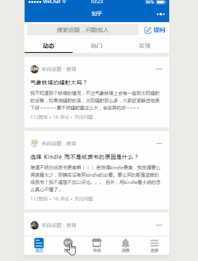

   * 首页切换

   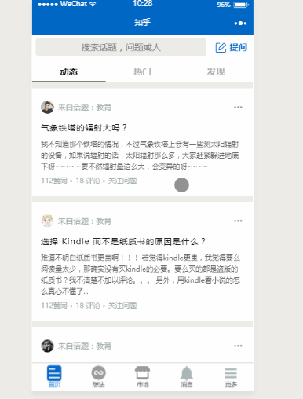

   * 上拉刷新下拉加载

   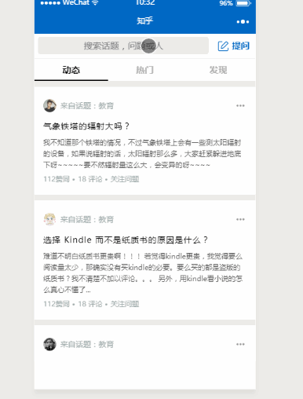

   * 点击事件及页面跳转

   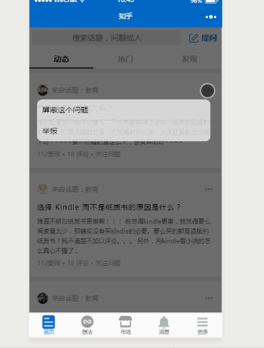

   * 评论功能

   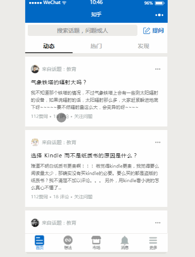

   上面是目前项目已经实现的部分，其他功能在日后会继续实现。

   ### 项目的初心

   在整个项目开始之前，我思考过这个问题，我写这个项目是为什么，这是自己写项目的动力，自己现在还处于学习阶段，更多的是想通过这个项目自己能够学到什么，编程技巧，编程思想，对小程序的熟悉程度等等，所以自己在写代码的时候多去用用之前自己没有接触过的东西，例如commonJS中的文件引入的方法同时也使用了ES6中模块化引入的方法等等，很多人可能不理解为什么要这么用，明明可以那样做。对于一个学习者来说，要尽可能的在一个项目中多用到不同的方法，让自己知道有这么个东西的存在并学会掌握方便日后的项目中的使用，这才实现了做这个项目的价值。即对现在的我来说，仿知乎这个项目的初心是为了学习更多自己没有接触到的东西，让自己对编程有进一步的了解。

   ### 项目介绍

   * 项目起步

   项目开始的时候我首先思考的问题就是文件排版，一个完整的项目应该对文件有一个合理的结构，需要模块化，增强项目的可读性，操作和以后维护起来也就更加的方便了。看看自己的文件的目录:

   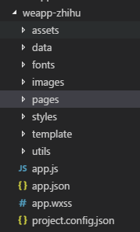 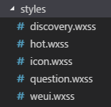 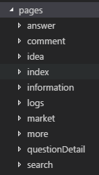 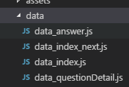 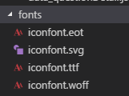 

   上面就是自己项目的主要目录了，按照自己的想法对其分解，但是还是存在着很多的问题，编写的并不是很好，很多的功能的实现代码没有单独的用不同的文件区分开，都是在一个文件中编写，这需要进一步的优化，模块化在编程中是一个挺重要的思想，可以很好的实现代码的重用性，可以节约一定的开发时间。最近也在看看前端工作流的一些东西，项目目录也是分为开发目录和上线目录，可以通过babel、gulp、webpack等对开发文件的一些处理，也是挺不错的一种思想，对这了解的还不是很多，还在学习中，以后项目开发中可以用，增加自己对企业级开发的实践，这也是大家可以学习的一个方向。

   * 后台数据方面

   开发项目中不可缺少的就是数据了，现在的项目中的页面不再可能是静态页面了，把数据给写si了，这没有任何价值，同时也增加了编程的工作量，代码也很冗长。这就需要模拟后台数据，可以实现列表式渲染数据，减少了很多的工作量，这就出现了一个问题，怎么模拟后台数据，用什么去模仿数据，很多人会用第三方提供的，例如使用easy-mock，通过wx.request()来获取数据，实现页面加载数据，相信这种方式大家都会用。如果在本地写假数据，那我们又该用什么写，怎样获取数据，对一个初学者来说应该是不太清楚的（大佬除外），这个就是我们可以学习的地方，学会用不一样的方式去做一件事，这就会实现做这个项目的目的。

   说到这里，数据应该是放在js文件中，一般后台数据都是JSON格式，所以放在js文件最为合理了，这时问题又出现了，我们怎么获取里面的数据呢？想到这个我也不晓得怎么获取里面的数据，看到前辈有用到require（）的方式获取数据，想想这个是什么东西，开发经验不足，不晓得这个是什么东西，自己就会主动的去了解这个是什么东西，原来这个是node中CommonJS中的模块实现，js之前并没有很好的实现模块化编程，几乎所有的代码都写在一个文件中，CommonJS的出现，实现了JS的模块化，同时自己也晓得了ES6中也有了属于自己模块化的方式了，使用import、export方式实现模块化编程，感觉自己又学到了，在自己的项目中就都有用到这两种方式来获取数据：

    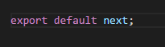 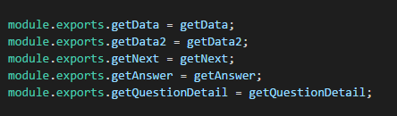 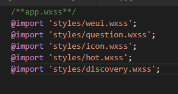 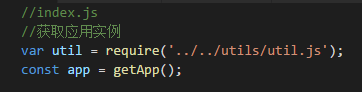 

   看上面的图片，就可以看到我两种方式在一个项目中都是有使用到的，你可能没有看懂下哦贴出来的是什么，你不需要看懂，现在快去看看CommonJS和ES6中模块化的知识，你又会学到东西的！！！有人就会不理解，干嘛要在本地写假数据啊，这不在占存储量吗，为什么要用两种模块化的方式啊，一种不就行了吗等等问题，其实我做的不是“项目”，我更多的是想通过这个项目我能学到什么东西，这里我知道了两种模块化的方式，然后我可以在后面多花点时间对着两种模块化方式深入学习，这个就是我想要的结果，真正的项目开发中就不要把假数据放在本地，也不要一件事情同时使用两种方式去做，现在可以玩玩，哈哈哈哈哈哈哈！！！！！

   * 引用第三方框架问题

   很多人肯定也思考过做项目是否使用第三方框架，还是自己写原生代码，这个问题就要看自己的想法了，我就说说我自己的看法，我现在接触前端的时间不长，很多的东西都不是很清楚，像wxss的样式想自己去写，多熟悉样式属性，其实让我用第三方的框架我也不是很会用，但是还是要多去用，要“会”用框架。在这个项目中大部分的wxss文件都是自己写的，到了后面有的功能的样式，我也用了第三方框架，像小程序中常用的UI框架中有weui，这个很好用，微信团队开发的一个框架，提供了很多的组件，可以减少很多的开发时间。

   我的态度是，如果是学习的态度那就自己写原生代码这样提升我认为是比较快的，如果是实际开发项目，那就是能用框架那就用框架，不要自己造轮子。

   * 项目主要功能实现过程中的思考

   小程序开发模式和我们传统的开发模式很不相同，传统的开发中我们一般是使用dom操作来动态的改变页面，让我感觉的是一种查找的方式，使用dom操作，找到某个元素然后再改变该元素的行为，从而改变了页面的状态，而小程序的开发模式是MVVM，数据绑定页面，数据的改变从而使得页面状态发生改变，这个传统的开发很不相同，这个在小程序开发很容易踩坑，自己在这个项目中就踩到过这个坑，要理解好MVVM模式。

   1. 按钮点击弹窗事件

   ```
   <block wx:for="{{feed}}" wx:for-index="idx" wx:for-item="item" wx:key="idx" data-idx="{{idx}}" >
  <view  class="feed-item">      
     <view class="feed-source">
       <!--遮罩层-->
       <view class="drawer_screen" bindtap="hide" data-statu="close" wx:if="{{showModalStatus}}"></view>
       <!--弹窗事件触发-->
       <view bindtap="powerDrawer" data-statu="open" data-answerId="{{item.answer_id}}">
           <image class="item-more" mode="aspectFit" src="../../images/more.png"></image>
       </view>
     </view>
     <!--弹窗页面-->
     <view animation="{{animationData}}" data-answerId="{{item.answer_id}}" class="drawer_box" wx:if="{{showModalStatus&&item.isSelected}}">
        <view class="drawer_shield">屏蔽这个问题</view>
        <view class="drawe_report">举报</view>
     </view>
  </view>
</block>
   ```

   ```
   var util = require('../../utils/util.js');const app = getApp();
Page({ 
    // 页面初始数据
    data: {
    //  数据源feed: [],
    //  更多按钮 触发弹窗
    showModalStatus: false ,
    },
    // 弹窗触发事件
    powerDrawer: function (e) { 
      // 获取数据源
      let feed = this.data.feed;
    // 得到按钮点击时设置的数据值 
        data-answerId
        let answer_id = e.currentTarget.dataset.answerid;
        // 得到按钮点击时设置的数据值 data-statu
        let currentStatu = e.currentTarget.dataset.statu;
        // 遍历数据源
        for(let key of feed)
        {
           if(key.answer_id === answer_id){      
               key.isSelected = true;
            }
        }
        this.setData({
           feed:feed,
        });
        // 弹出窗
        this.util(currentStatu);}
    })
   ```

   ```
   //数据源模板
var next = {
  "data": [
        {
          "topic": "教育",         
          "answer_id": 1,
          ...
        },
        {
           "topic": "教育",
           "answer_id": 2,
           ...
        },
        {
           ...
        },
        ...
    ]
}
   ```
   上面就是点击按钮弹窗事件的主要代码，因为做的是列表式数据渲染，基本页面的布局只写了一个，通过js中的数据绑定，可以将数据源中的所有的数据都可以导入页面中，这样可以减少很多的工作量。现在就和大家分享我在写这个触发事件遇到的问题，大家看下面的图就清楚问题在哪里了：

   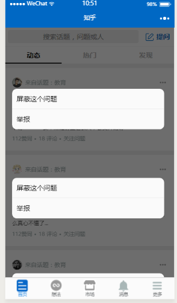

   看到图就晓得了问题来了，单独点击一个，其他框也触发了弹窗事件，这是做列表式渲染数据都容易遇到的问题，遇到的坑，为什么会出现这种问题呢，原因很简单，因为在写页面布局的时候，我们是通过<block wx:for=""></block>动态填充数据的，基本的样式只写了一个，每一个数据都有bindtap触发事件

   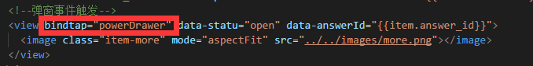

   起初遇到这个问题，我想的办法是，数据源中的数据是写在数组中，每一数据都有自己固定的"answer_id" ，然后我在触发弹窗时填入一个数据data-answerId="{{item.answer_id}}"，设置的值也为answer_id，我就想通过查找的方式，找到每一个数据的answer_id再和触发按钮时的设置的数据进行对比，如果值一样，就弹出其自身的窗，然而并没有解决问题，下面是最初设计的代码：

   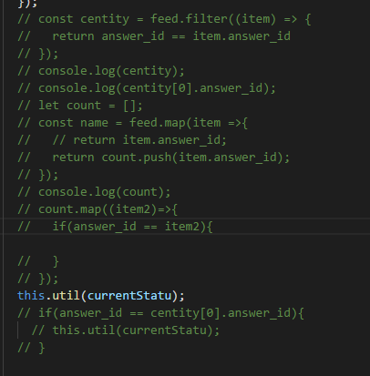

   这就是想通过查找的方式来解决问题，没有做到，原因是你每次查找的值和你触发时设置的值都是一样的，所以是解决不了问题的，这种做法就还停留在传统的开发设计，如dom操作，不断的查找，找到某个值，然后再改变它。单纯的使用这种做法在小程序有些难度来解决问题了，其实要正确的理解MVVM模式，这个问题就很好解决了，数据绑定页面，数据改版页面的状态。
  
   解决这个问题的方法就是为每一个数据添加一个布尔值，触发自身的按钮事件时其布尔值为true，其他的数据的布尔值为false

   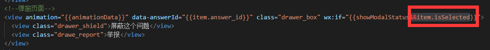
   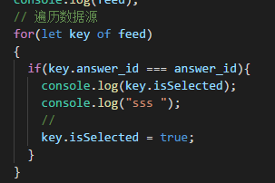

   这样的写法就很好的解决了问题，查找操作和数据绑定操作一起解决问题。

   2. 评论功能
   ```
   <view class="comment-bd">
   <view class="ordinaryComment">
       <text>评论</text>
    </view>
    <block wx:for="{{item.ordinaryComment}}" wx:key="index">
        <view class="user-comment">
           <view class="user-avatar">
             <image src="{{item.feed_source_img}}"></image>
           </view>
            <view class="comment-content">
               <view class="user-name">
                    <text>{{item.feed_source_name}}</text>
               </view>
               <view class="answer-content">
                    <text>{{item.content}}</text>
               </view>
               <view class="comment-action">
               <view class="like dot">
                    <text>点赞 {{item.good_num}}</text>
                </view>
               <view class="comment dot">
                     <text>回复{{item.comment_num}}</text>
               </view>
               <view class="time">
                      <text>{{item.time}}</text>
                </view>
          </view>
      </view>
     </view>
   </block>
  </view>
 <view class="comment-ft">
     <view class="commentInput">
        <input type="text" value="{{content}}" bindinput="onTextChanged" placeholder="请输入评论" placeholder-class="placeholderClass" />
     </view>
      <view class="commentBtn">
          <text bindtap="onSendClicked" data-questionId="{{item.question_id}}">发布</text>
       </view>
</view>
   ```

   ```
   var util = require('../../utils/util.js');
let myComment = '';
Page({
   data: {     
        comment: [],    
        content: "", 
        },
    onTextChanged: function(e){
     //获取文本框的值，即输入的评论的内容
      myComment = e.detail.value; 
     },
    onSendClicked: function(e){
        //获取触发时设置数据的值
        let question_id = e.target.dataset.questionid;
        var that = this,conArr = [];
        //定时器，100ms后触发
        setTimeout(function(){
            //将评论的基本信息存入数组
             if(myComment.length > 0){
                 conArr.push({     
                 "feed_source_img": "../../images/icon9.jpeg",     
                 "feed_source_name": "zero",     
                 "time": util.formatTime(new Date()),     
                 "good_num": "0",    
                  "comment_num": "0",     
                  "content": myComment     
      })
        //从数据源中获取评论页面的所有数据
        var feed = util.getData2();
        let comment_data = feed.comment;
        //找到指定页面的评论数据
        const comment = comment_data.filter((comment) => {
           return question_id == comment.question_id;})
            //将添加的评论的基本信息数组conArr合并到数据源中评论数据的数组comment[0].ordinaryComment中
            var commentContent = comment[0].ordinaryComment.concat(conArr);
            //将新加入的conArr数组放在源数组中的第一位，便于触发提交评论时评论内容出现在页面的第一栏
            var newCommentContent = commentContent.reverse();
            var newComment = comment[0];
            comment[0].ordinaryComment = newCommentContent;
            that.setData({
                comment: comment,
                content: ""
            })
        }
       },100)
    },
})
   ```

   上面就是评论功能的主要代码，要实现这个功能主要解决的问题是找到指定问题的评论页面，通过Array.filter()方法可以找到指定问题的评论页面，然后又解决的问题是将填写的评论信息加到数据源中评论数据的数组comment[0].ordinaryComment中，通过Array.concat()方法可以实现，最后就是将新的数据展示到页面上，更新页面状态，其中还有一个地方主要注意：如何将输入的评论信息，显示在评论栏的第一栏，Array.reverse()可以解决这个问题，这样就比较好的实现了这个功能。

   3. 其他功能总结

   像比较常见的功能还有首页顶部的tab切换，可以使用swiper-item组件和bindtap进行事件绑定，可以实现这种tab切换的效果，下拉刷新的可以使用scroll-view组件，组件里面提供了很多的属性可以实现很多的功能，还有基本的弹窗功能的组件有wx.showToast()、wx.showActionSheet（OBJECT）、wx.showModal(OBJECT)等等，这些组件都可以看官方文档学习，学习利用基本组件。

   ### 相关文档和工具

   1. [小程序开发文档](https://www.w3cschool.cn/weixinapp/9wou1q8j.html) 学会使用开发文档，多看开发文档，熟悉组件，避免自己不必要的麻烦提供
   2. [commonJS学习](http://javascript.ruanyifeng.com/nodejs/module.html) 比较强的模块化的学习
   3. [ES6模块化](http://es6.ruanyifeng.com/#docs/module) 属于自己的模块化开发
   4. [iconfont](http://www.iconfont.cn/home/index?spm=a313x.7781069.1998910419.2) [@font-face](http://www.w3school.com.cn/css3/css3_font.asp) 学会使用CSS3 font-size属性 页面图片不再是png格式了，值得学习
   5. [weui](https://github.com/DengSongsong/weui-wxss) 学会使用第三方框架，小程序需要学习weui
   6. [小程序开发者工具](https://mp.weixin.qq.com/debug/wxadoc/introduction/qcloud.html#%E4%B8%80%E3%80%81%E9%80%9A%E8%BF%87%E5%BE%AE%E4%BF%A1%E5%85%AC%E4%BC%97%E5%B9%B3%E5%8F%B0%E6%8E%88%E6%9D%83%E7%99%BB%E5%BD%95%E8%85%BE%E8%AE%AF%E4%BA%91) 小程序开发工具

   ### 结束

   这次的学习学到了挺多东西的，要想清除做这个项目的目的是什么，这个项目我的目的就是为了学习，晓得了自己缺少什么，什么需要去加强学习的，在整个项目的完成过程中，其实感觉到了自己的功利心，希望自己快点把项目做完，这个在学习的过程中是很不好的，忘记了自己做项目的初心，作为一个学习者，我们应该多想想做这个项目能给自己带来什么，我可以通过行动具体的给自己带来哪些帮助，我们应该要实现这个项目对自己的最大效益，这才是这个项目的存在价值，要对得起这个项目，不要仅仅趋于我做了这个项目，做好了，我不管了，需要不忘初心的学习，做一个有思想的程序猿！！！！！

   最后附上这个项目的github地址和个人的联系方式，我们可以一起交流学习，共同进步
   项目地址：[https://github.com/DengSongsong/weapp-zhihu](https://github.com/DengSongsong/weapp-zhihu)
   个人邮箱：DengSongsong1010@163.com
   wx: dss1000010
   如果觉得这篇文章和项目有好处，欢迎star哦，谢谢大家！！！
